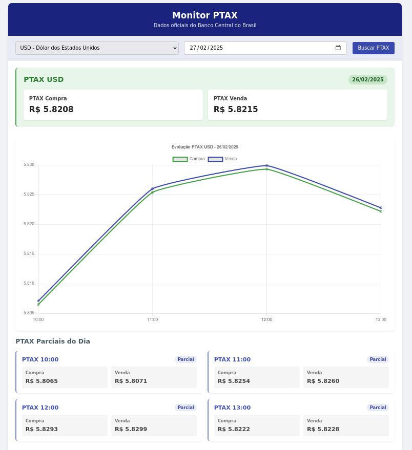

<h1 align="center">
  💻 Projeto - Monitor Ptax
</h1>

<h4 align="center"><a href="https://ornate-buttercream-a352c0.netlify.app/">Clique para visitar o projeto</a></h4>

## 📚 Descrição
O **Monitor PTAX** é uma aplicação web que permite consultar as cotações de compra e venda de moedas estrangeiras, com base nas taxas oficiais do Banco Central do Brasil (PTAX). Ele permite aos usuários buscar cotações de moedas específicas para uma data selecionada e visualiza tanto as cotações finais quanto as cotações parciais ao longo do dia.

## Funcionalidades
- **Seleção de Moeda**: O usuário pode escolher a moeda para a qual deseja consultar as cotações entre várias opções suportadas pela API do Banco Central.
- **Seleção de Data**: O usuário pode selecionar uma data específica para consultar as cotações PTAX daquele dia.
- **Exibição das Cotações**: O sistema exibe a cotação de compra e venda para a data selecionada, com uma média final e as cotações parciais entre as 10h00 e 13h00.
- **Interface Simples e Responsiva**: A aplicação possui uma interface intuitiva e adaptável a diferentes tamanhos de tela, tornando-a fácil de usar em dispositivos móveis e desktops.

## Como Funciona
1. **Carregamento das Moedas**: A aplicação consulta a API do Banco Central para carregar a lista de moedas disponíveis no sistema.
2. **Escolha de Moeda e Data**: O usuário escolhe a moeda e a data desejada para consulta das cotações PTAX.
3. **Busca e Exibição de Dados**: Ao clicar no botão "Buscar PTAX", a aplicação realiza uma requisição à API do Banco Central para obter as cotações de compra e venda da moeda selecionada para a data informada.
4. **Exibição dos Resultados**: Os resultados são exibidos em um formato organizado, com a cotação média final e as cotações parciais.

## Como Usar
1. Faça o clone deste repositório para a sua máquina local.
2. Abra o arquivo `index.html` em um navegador web.
3. Selecione a moeda desejada na lista de opções.
4. Escolha a data para a qual deseja consultar as cotações.
5. Clique no botão **Buscar PTAX** para visualizar as cotações.

## 💼 Tecnologias utilizadas

Para o desenvolvimento deste site utilizei as seguintes tecnologias:

- HTML;
- JavaScript;
- Css;

---
